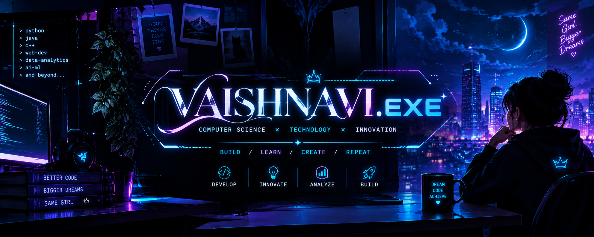

  

 

# VAISHNAVI.EXE

### COMPUTER SCIENCE & BUSINESS SYSTEMS

 

---

## ◈ ABOUT ME

- 🎓 B.Tech student in **Computer Science and Business Systems (CSBS)**.
- 🏫 Studying at **B. V. Raju Institute of Technology (BVRIT)**.
- 🐍 Interested in Python programming and practical project development.
- 💻 Exploring programming, data analysis, and software development.
- 🚀 Focused on learning new skills by building projects.

---

## ◈ TECH STACK

  

---

## ◈ FEATURED PROJECTS

### ⚡ Dynamic Equity Engine

A Python-based team contribution analysis project focused on understanding individual participation and identifying inactive or low-contributing team members.

**Project focus**
- Analyze individual contributions.
- Understand participation across a team.
- Identify members with low or no recorded contribution.

### 📊 Customer Behaviour Analysis

A project focused on exploring customer-related data and understanding customer behaviour patterns.

---

## ◈ GITHUB STATISTICS

  
  

---

## ◈ MY APPROACH

| MODULE | FOCUS |
|---|---|
| `01 / LEARN` | Build a strong technical foundation |
| `02 / BUILD` | Turn ideas into practical projects |
| `03 / ANALYZE` | Explore data and solve problems |
| `04 / IMPROVE` | Learn from feedback and keep growing |

---

## ◈ CONNECT

  

LEARN • BUILD • IMPROVE

